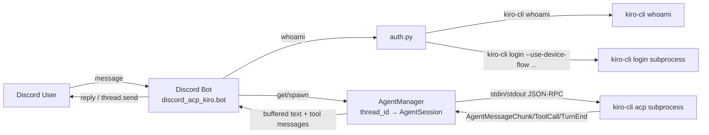

# Discord ACP Client for Kiro CLI

A Discord bot that lets you drive [Kiro CLI](https://kiro.dev) from anywhere through Discord.
Each top-level channel message starts a new Kiro session in a freshly created thread; replies
in that thread resume the same session. The bot speaks JSON-RPC 2.0 (NDJSON) over stdio to a
`kiro-cli acp` subprocess and handles authentication (including remote device-flow login)
through Discord UI components.

## Architecture



## Prerequisites

- Python 3.14+
- [`uv`](https://docs.astral.sh/uv/) package manager
- `kiro-cli` installed and on your `PATH`

## Configuration

Copy `.env.example` to `.env` and fill in the values:

| Key | Default | Description |
| --- | --- | --- |
| `DISCORD_TOKEN` | (required) | Discord bot token |
| `KIRO_SESSION_CWD` | bot CWD | Working directory for Kiro sessions |
| `KIRO_CLI_BIN` | `kiro-cli` | Path to the `kiro-cli` binary |
| `KIRO_IDLE_TIMEOUT_SECONDS` | `300` | Idle timeout before a per-thread subprocess is reaped |
| `LOGIN_TIMEOUT_SECONDS` | `300` | Device-flow login timeout |
| `LOG_FILE` | `bot.log` | Rotating log file path |

## Discord application setup

1. Create an application at the [Discord Developer Portal](https://discord.com/developers/applications).
2. Add a Bot and enable the **Message Content Intent** under Bot → Privileged Gateway Intents.
3. Invite the bot with OAuth2 scope `bot` and permissions:
   - Send Messages
   - Create Public Threads
   - Send Messages in Threads
   - Read Message History

## Run

```bash
uv sync
cp .env.example .env   # then fill in DISCORD_TOKEN
uv run discord-acp-kiro-bot
```

## Test

```bash
uv run pytest
```

## Authentication walkthrough

1. Send a message in a guild text channel.
2. If Kiro is not authenticated, the bot replies with an **Authenticate** button.
3. Clicking it opens a modal asking for your **Identity Provider URL** and **Region**
   (defaults to `us-east-1`).
4. On submit, the bot runs `kiro-cli login --use-device-flow` and posts the verification
   code + URL with a **Cancel** button.
5. Complete the login in your browser. On success the bot replies "Authenticated successfully."
   and forwards your original message to Kiro.

## Troubleshooting

- Check `bot.log` (rotating, in the CWD) for tracebacks.
- Run `kiro-cli whoami` to confirm local authentication state.
- If a thread reports the session no longer exists, start a new conversation in a regular channel.

## Future improvements

1. Queue prompts arriving during an in-flight turn (instead of cancelling).
2. Forward Discord image attachments as ACP image content blocks (`promptCapabilities.image`).
3. Tool-call approval gating with Approve/Deny buttons in Discord.
