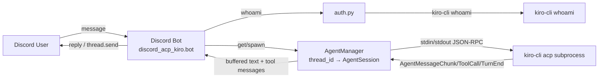

# Discord ACP Client for Kiro CLI

A Discord bot that lets you drive [Kiro CLI](https://kiro.dev) from anywhere through Discord.
Each top-level channel message starts a new Kiro session in a freshly created thread; replies
in that thread resume the same session. The bot speaks JSON-RPC 2.0 (NDJSON) over stdio to a
`kiro-cli acp` subprocess. Kiro must be authenticated on the host (via `kiro-cli login`);
the bot detects an unauthenticated host and offers a **Retry** button so you can resend
your message once login is complete.

## Architecture



## Prerequisites

- Python 3.14+
- [`uv`](https://docs.astral.sh/uv/) package manager
- `kiro-cli` installed and on your `PATH`

## Configuration

Copy `.env.example` to `.env` and fill in the values:

| Key | Default | Description |
| --- | --- | --- |
| `DISCORD_TOKEN` | (required) | Discord bot token |
| `KIRO_SESSION_CWD` | bot CWD | Working directory for Kiro sessions |
| `KIRO_CLI_BIN` | `kiro-cli` | Path to the `kiro-cli` binary |
| `KIRO_MODEL` | `auto` | Default model for Kiro sessions (set per-session via ACP `session/set_model`; see `kiro-cli chat --list-models`). **Takes precedence over the model declared in a `KIRO_AGENT` config** — see the note below |
| `KIRO_AGENT` | (none) | Agent/persona to launch sessions with (`kiro-cli acp --agent`); defines the system prompt and tools. Create one with `kiro-cli agent create` |
| `KIRO_IDLE_TIMEOUT_SECONDS` | `300` | Idle timeout before a per-thread subprocess is reaped |
| `LOG_FILE` | `bot.log` | Rotating log file path |

> **Model precedence:** When both `KIRO_AGENT` and `KIRO_MODEL` are set, `KIRO_MODEL`
> wins. The agent launches with the model declared in its JSON config, but the bot then
> immediately calls `session/set_model` with `KIRO_MODEL`, overriding it. The default of
> `auto` applies only when `KIRO_MODEL` is left **unset**; if you instead set it to an
> empty value (`KIRO_MODEL=`), the bot skips the `session/set_model` override entirely and
> the agent's own configured model takes effect.


## Discord application setup

1. Sign in to the [Discord Developer Portal](https://discord.com/developers/applications) and click **New Application**. Give it a name and confirm — this creates the application that will host your bot.
2. Open the **Bot** tab for the application and add a bot user if one is not created automatically. Then scroll to **Privileged Gateway Intents** and enable the **Message Content Intent**. This is required so the bot can read the text of your messages and forward them to Kiro; without it the bot only sees empty message content.
   - In **Bot → Authorization Flow**, disable the **Public Bot** option so that only you can invite the bot. Since this bot drives Kiro CLI on your host, you don't want anyone else adding it to their servers.
   - Discord won't let you disable **Public Bot** while an install link is configured. First go to **Installation** and set **Install Link** to **None**, save, then return and disable **Public Bot**. Otherwise Discord rejects the change with a "private app cannot have install fields" error.
3. Generate an invite link and use it to add the bot to your server:
   - Go to the **OAuth2 → URL Generator** tab.
   - Under **Scopes**, check **`bot`**.
   - A **Bot Permissions** panel appears below. Check the following permissions:
     - Send Messages
     - Create Public Threads
     - Send Messages in Threads
     - Read Message History
   - Copy the **Generated URL** at the bottom of the page and open it in your browser.
   - In the authorization prompt, select the server you want to add the bot to (you must have the **Manage Server** permission on it), then click **Authorize** and complete any CAPTCHA. The bot now appears in your server's member list and is ready to receive messages.

## Run

```bash
uv sync
cp .env.example .env   # then fill in DISCORD_TOKEN
uv run discord-acp-kiro-bot
```

## Test

```bash
uv run pytest
```

## Docker

Run the bot in an isolated, non-root container with `kiro-cli`, a uv-managed
Python 3.14, and Homebrew bundled in (so agents can install packages without
root). Kiro auth and the working directory persist on named volumes.

```bash
cp .env.example .env   # set DISCORD_TOKEN
docker build -t discord-acp-kiro:latest .
docker volume create discord-acp-kiro-data
docker run -d --name discord-acp-kiro --env-file .env \
    --restart unless-stopped --security-opt no-new-privileges --cap-drop ALL \
    -v discord-acp-kiro-data:/home/bot/.kiro \
    discord-acp-kiro:latest
docker exec -it discord-acp-kiro kiro-cli login   # one-time device-flow auth
```

See [docs/docker.md](docs/docker.md) for authentication, package management,
persistence, and the security model.

## Authentication

Kiro must be authenticated on the **host** running the bot. The bot does not perform
login itself — `kiro-cli login` opens a browser on the host and never exposes the
verification URL, so it can't be driven remotely.

1. Send a message in a guild text channel.
2. If Kiro is not authenticated, the bot replies that the host needs login, with a
   **Retry** button.
3. On the host, run `kiro-cli login` (or `kiro-cli login --use-device-flow`) and complete
   the browser step.
4. Click **Retry**. The bot re-checks `whoami` and, if now authenticated, resends your
   original message to Kiro — no need to retype it.

## Troubleshooting

- Check `bot.log` (rotating, in the CWD) for tracebacks.
- Run `kiro-cli whoami` to confirm local authentication state.
- If a thread reports the session no longer exists, start a new conversation in a regular channel.

## Future improvements

1. Queue prompts arriving during an in-flight turn (instead of cancelling).
2. Forward Discord image attachments as ACP image content blocks (`promptCapabilities.image`).
3. Tool-call approval gating with Approve/Deny buttons in Discord. See [docs/tool-call-approval.md](docs/tool-call-approval.md) for the feasibility investigation and implementation sketch.
